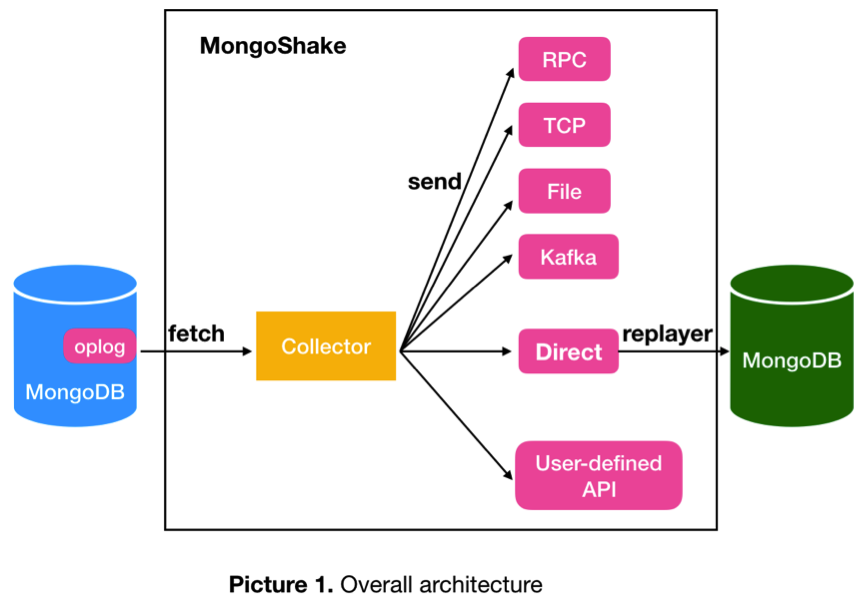

This is a brief introduction of Mongo-Shake, please visit [english wiki](https://github.com/aliyun/mongo-shake/wiki/MongoShake-Detailed-Documentation) or [chinese wiki](https://yq.aliyun.com/articles/603329) if you want to see more details including architecture, data flow, performance test, business showcase and so on.

*  [English document](https://github.com/aliyun/mongo-shake/wiki/MongoShake-Detailed-Documentation)
*  [中文架构介绍文档](https://yq.aliyun.com/articles/603329)
*  [第一次使用，如何配置](https://github.com/alibaba/MongoShake/wiki/%E7%AC%AC%E4%B8%80%E6%AC%A1%E4%BD%BF%E7%94%A8%EF%BC%8C%E5%A6%82%E4%BD%95%E8%BF%9B%E8%A1%8C%E9%85%8D%E7%BD%AE%EF%BC%9F)
*  [Tutorial](https://github.com/alibaba/MongoShake/wiki/tutorial-about-how-to-set-up)
*  [FAQ document](https://github.com/aliyun/mongo-shake/wiki/FAQ)
*  [MongoShake最佳实践](https://yq.aliyun.com/articles/719704)
*  [Performance test document](https://github.com/aliyun/mongo-shake/wiki/MongoShake-Performance-Document)
*  [WeChat discuss group](https://github.com/aliyun/mongo-shake#shake-series-tool)

# Mongo-Shake
---
Mongo-Shake is developed and maintained by Nosql Team in Alibaba-Cloud. 
Mongo-Shake is a universal platform for services based on MongoDB's oplog. It fetches oplog from source mongo database, and replays in the target mongo database or sends to other ends in different tunnels. If the target side is mongo database which means replay oplog directly, it's like a syncing tool that used to copy data from source MongoDB to another MongoDB to build redundant replication or active-active replication. Except for this direct way, there are others tunnel types such like rpc, file, tcp, kafka. Receivers wrote by users must define their own interfaces to connecting to these tunnels respectively. Users can also define there own tunnel type which is pluggable. If connecting to a third-party message middleware like kafka, the consumer can get the subscriber data in an asynchronous way in pub/sub module flexibly.
Here comes general data flow,  
 
The source can be either single mongod, replica set or sharding while target can be mongod or mongos. If the source is replica set, we suggest fetching data from secondary/hidden to ease the primary pressure. If the source is sharding, every shard should connect to Mongo-Shake. There can be several mongos on the target side to keep high availability, and different data will be hashed and written to different mongos.

# Parallel Replication
---
There are three options for parallel replication which we call 'shad\_key': __id__, __collection__ and __auto__. __id__ means the concurrency granularity is document while __collection__ means the granularity is collection/table. __auto__ option is decided by if there has unique index of any collection, it will change to __collection__ with unique index exist otherwise __id__.

# High Availability
---
Mongo-Shake periodically persistent its context into register center which by default is the source database. Currently, the context is checkpoint which marks the position of successfully replay oplog. 
Hypervisor mechanism is also supported so that it will restart immediately when dies(`master_quorum` in configuration).

# Filter
---
Support filtering database and collection namespace with whitelist and blacklist.

# DDL Syncing
---
Starting with version 1.5, MongoShake supports syncing DDL by using global barrier. Once fetching DDL oplog, MongoShake adds a barrier so that all the belowing oplogs waitting in the queue until this oplog is written into the target MongoDB or tunnel and the checkpoint is updated. Currently, DDL is only support for ReplicaSet on the source side(target side can be RelicaSet or Sharding), we will support Sharding in the later version. 
 

# Global ID
---
In Aliyun internal version, global id(also called gid) is supported which marks the id of the database. It can be used to avoid loop when two databases become backup of each other. Mongo-Shake only fetches the oplogs equal to source database id, all the oplogs are be fetched when no gid gave. For current opensource version, it's not supported limited by the modification of MongoDB kernel. 
If you want to build active-active replication without `gid` supported, please visit [FAQ document](https://github.com/alibaba/MongoShake/wiki/FAQ) to see more details. 

# Tunnel
---
As mentioned above, we support several tunnel types such like: rcp, tcp, file, kafka, mock and direct. __rpc__ and __tcp__ means connecting to receiver synchronously by net/rcp and TCP respectively; __file__ means writing output into file; __kafka__ is an asynchronous way of sending the message; __mock__ is used by testing that throws away all the data; __direct__ means writing into target MongoDB directly. Users can also add or modify current tunnel type. 
We offer receiver to connect to different tunnels like: rpc, tcp, file, mock and kafka. Please visit [FAQ document](https://github.com/aliyun/mongo-shake/wiki/FAQ) to see more details.

# Compressor
---
Gzip, zlib, deflate compressor are supported in batched oplogs before sending.

# Monitor & Debug
---
User can monitor or debug Mongo-Shake through RESTful API, please visit [FAQ document](https://github.com/aliyun/mongo-shake/wiki/FAQ) to see more details.

# Other Details
---
Mongo-Shake uses [mgo.v2 library](https://github.com/vinllen/mgo) which is a modification version of [mgo.v2](https://github.com/go-mgo/mgo/tree/v2) to fetch oplogs from source MongoDB which is later than the given timestamp in configuration. Then, it filters oplogs based on whitelist, blacklist, and gid. All the oplogs will be transferred at least once which is acceptable because of idempotent of oplog DML. We use __seq__ and __ack__ to make sure the package is received which is similar to the sequence and acknowledgment numbers in TCP. 
The oplogs are batched together in the handling pipeline. 
Users can adjust the worker concurrency and executor concurrency according to the different environment. 
Please see the detail documents listed at the beginning if you want to see more details. 

# Code branch rules
version rules: a.b.c.

*  a: major version
*  b: minor version. **even number means stable version**. e.g. 1.2.x, 1.4.x, 2.0.x are stable while 1.5.x, 2.1.x aren't.
*  c: bugfix version

| branch name | rules |
| - | :- |
| master | master branch, do not allowed push code. store the latest stable version. |
| **develop**(main branch) | develop branch. all the bellowing branches fork from this. |
| feature-\* | new feature branch. forked from develop branch and then merge back after finish developing, testing, and code review. |
| bugfix-\* | bugfix branch. forked from develop branch and then merge back after finish developing, testing, and code review. |
| improve-\* | improvement branch. forked from develop branch and then merge back after finish developing, testing, and code review.  |

tag rules:
add tag when releasing: "release-v{version}-{date}". for example: "release-v1.0.2-20180628"

# Usage
---
Run `./bin/collector.darwin64` or `collector.linux64` which is built in OSX and Linux respectively. 
Or you can build mongo-shake yourself according to the following steps:
*  git clone https://github.com/alibaba/MongoShake.git
*  cd MongoShake
*  export GOPATH=\`pwd\`
*  cd src/vendor
*  govendor sync    #please note: must install govendor first and then pull all dependencies: `go get -u github.com/kardianos/govendor`. Or, users can use govendor located in `tools` directory: `../../tools/govendor sync`
*  cd ../../ && ./build.sh
*  ./bin/collector -conf=conf/collector.conf #please note: user must modify collector.conf first to match needs. You can also use \"start.sh\" script which supports hypervisor mechanism in Linux OS only.

# Shake series tool
---
We also provide some tools for synchronization in Shake series. 

* [MongoShake](https://github.com/aliyun/MongoShake): mongodb data synchronization tool.
* [RedisShake](https://github.com/aliyun/RedisShake): redis data synchronization tool.
* [RedisFullCheck](https://github.com/aliyun/RedisFullCheck): redis data synchronization verification tool.

Plus, we have a DingDing(钉钉) group so that users can join and discuss, group id（钉钉群号）: 23165540.

# Thanks
---
| Username | Mail |
| :------: | :------: |
| lydarkforest | linyunads1379@163.com |
| diggzhang | diggzhang@gmail.com |
| ManleyLiu | daywbdb@qq.com |
| hustchensi | chensi_04@126.com |
| HelloCodeMing | huanmingwong@163.com |
| cocoakekeyu | cocoakekeyu@gmail.com |
| lixj1103 | 244769542@qq.com |
| xzshinan | shinan@gongchang.com |
| tzjavadmg | codyzeng@163.com |
| dx8439 | 171390022@qq.com |
| monkeyWie |  |
| raydy.yan | yajuyan@hotmail.com |
| loda507 | 741536172@qq.com |
